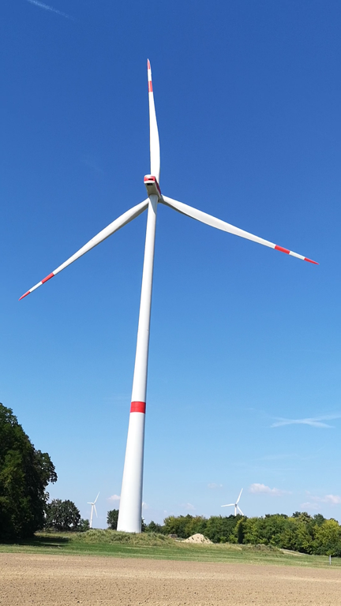
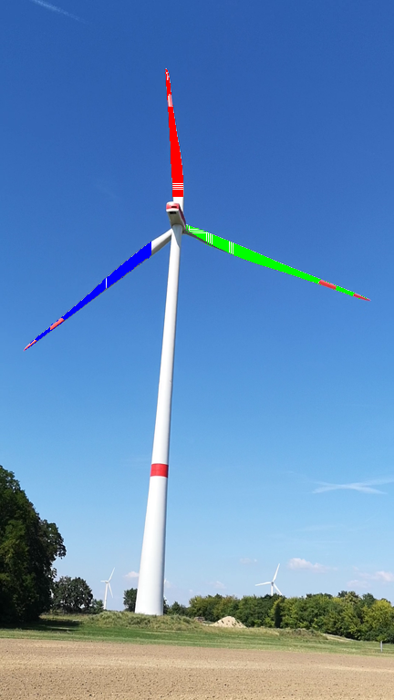
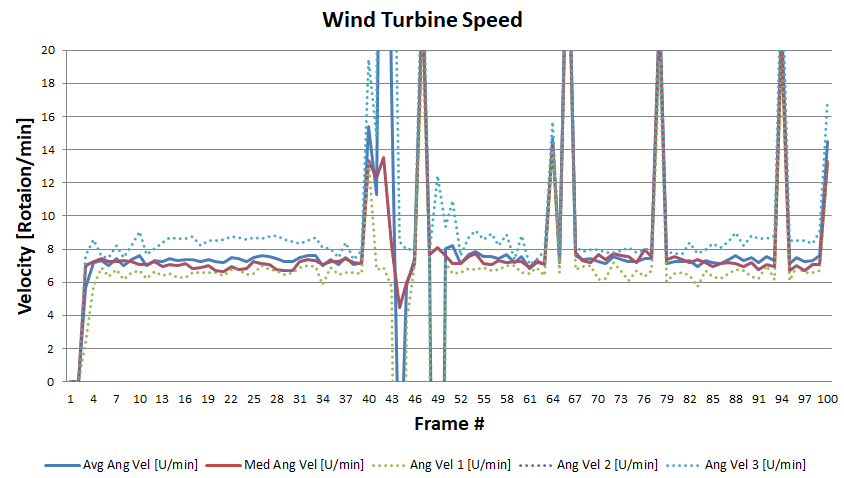

# wind_turbine_speedometer
Determines the angular velocity of a wind turbine from a video sequence. As an input, single frames extracted from a video for instance via VLC are first filtered using a region of interest and color thresholds to extract the pixels of the rotorblade. Afterwards, a clustering algorithm based on a Gaussian mixture model applied. The resulting cluster orientations are used for an estimate of the rotor blade orientations in each frame. Clusters of consecutive frames are matched by means of their mean distance such that angle offsets can be transformed into an angular velocity. The resulting velocities are exported into a CSV file and detected clusters are colored within the images.

## Dependencies for Running Locally
* cmake >= 3.7
  * All OSes: [click here for installation instructions](https://cmake.org/install/)
* make >= 4.1 (Linux, Mac), 3.81 (Windows)
  * Linux: make is installed by default on most Linux distros
  * Mac (not tested): [install Xcode command line tools to get make](https://developer.apple.com/xcode/features/)
  * Windows (not tested): [Click here for installation instructions](http://gnuwin32.sourceforge.net/packages/make.htm)
* gcc/g++ >= 5.4
  * Linux: gcc / g++ is installed by default on most Linux distros
  * Mac (not tested): same deal as make - [install Xcode command line tools](https://developer.apple.com/xcode/features/)
  * Windows (not tested): recommend using [MinGW](http://www.mingw.org/)
* no further external libraries required

## Basic Build Instructions

1. Clone this repo.
2. Make a build directory in the top level directory: `mkdir build && cd build`
3. Compile: `cmake .. && make`
4. Run it: `./wind_turbine_speedometer`.

## File and Class Structure Overview
* main.cpp
  * Contains the main program procedure:
    1. Search for image files in specified folder
    2. Run clustering algorithm on individual images using multi-threading
    3. After clustering, match clusters in consecutive frames by their distance
    4. Calculate angles for matched clusters of previous and current frame and determine angular velocity
    5. Color clusters in output images keeping matched clusters in same color
    6. Write angular velocities to CSV file
* clustering.h/cpp
  * Class Cluster: Represents a single cluster with its points, mean, covariance, and weighting wrt. the remaining clusters in the same model
  * Class ClusterModel: Mixture model of several clusters. For a given set of points clusters will be fitted by an expecation maximization algorithm (full derivation see: [Gaussian Mixture Model Explained](https://towardsdatascience.com/gaussian-mixture-models-explained-6986aaf5a95?gi=ad9aac903aef))
* parallel_image_processor.h
  * Class ParallelImageProcessor: Encapsulates multi-threading, mutex locking and unlocking, for running the cluster analysis on the images.
* img_converter.h/cpp
  * Class ImgConverter: Encapsulates loading saving, filtering, and extracting of image files. For the underlying image read and write functionality, the library by Sean T. Barret [stb](https://github.com/nothings/stb) are included.
* stb_image.h and stb_image_write.h
  * Library by Sean T. Barret [stb](https://github.com/nothings/stb) for basic image file access.
* utility.h
  * Contains utility functions such as cholesky decomposition or backward substition
* Folder Structure
  * src/ contains all source files
  * img/ contains all input image files
  * imgOut/ contains all output image and CSV files

## Udacity Capstone Project Rubric Points:
* The submission must compile and run
  * Compilation was tested on virtual machine
* Loops, Functions, I/O  
  * The project demonstrates an understanding of C++ functions and control structures.
    * Example for a variety of control structure see clustering.cpp
  * The project reads data from a file and process the data, or the program writes data to a file.
    * Image files are read in main.cpp line 77ff
    * CSV file is written in main.cpp line 179ff
  * The project accepts user input and processes the input.
    * The user is asked for the number of parallel threads to be run in main.cpp line 37ff
* Object Oriented Programming
  * The project uses Object Oriented Programming techniques.
    * See class ImgConverter
  * Classes use appropriate access specifiers for class members.
    * Seeclass ImgConverter starting line 10
  * Class constructors utilize member initialization lists.
    * See constructor in clustering.h line 58
  * Classes abstract implementation details from their interfaces.
    * Meaningful names are chosen and functionalities are commented in header files
  * Classes encapsulate behavior
    * See ImgConverter grouping all image access functions
  * Classes follow an appropriate inheritance hierarchy
    * Composition is used as class ClusterModel contains clusters of class Cluster
  * Overloaded functions allow the same function to operate on different parameters
    * Function save is overloaded depending whether filename is provided in img_converter.h line 50
  * Derived class functions override virtual base class functions.
    * Use of virtual base class was not suitable for this project
  * Templates generalize functions in the project
    * Template is used such that file ID could be exchanged by file name in parallel_image_processor.h line 14
* Memory Management
  * The project makes use of references in function declarations
    * See cholesky decomposition function in utility.h line 10
  * The project uses destructors appropriately
    * Default constructors/destructors are used
  * The project uses scope / Resource Acquisition Is Initialization (RAII) where appropriate.
    * In parallel_image_processor, point lists are allocated dynamically on the heap
  * The project follows the Rule of 5.
    * Rule is obeyed, as none of copy/assign/move/destructors were altered
  * The project uses move semantics to move data, instead of copying it, where possible.
    * Example in main.cpp line 98, moving data into parallel image processor
  * The project uses smart pointers instead of raw pointers
    * Frequent use of smart pointers for example in parallel image processor line 46. Exception of raw pointers 
* Concurrency
  * The project uses multithreading
    * In main.cpp line 96 several images are processed in parallel
  * A promise and future is used in the project.
    * Use of futures in main.cpp line 98 and returned in line 116 to receive frame ID
  * A mutex or lock is used in the project
    * In parallel_image_processor.h line 30 mutex is used, locked and unlocked
  * A condition variable is used in the project
    * In parallel_image_processor.h line 26 a condition variable is used to trigger next image